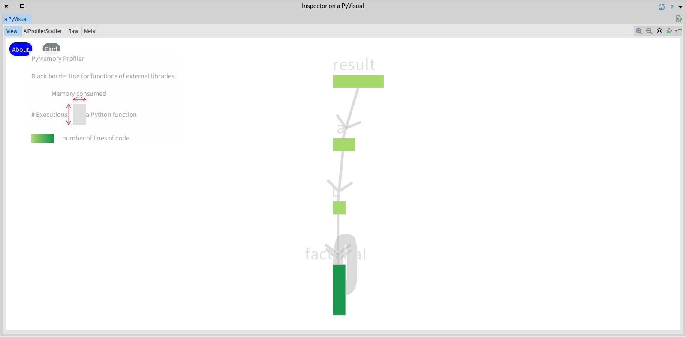
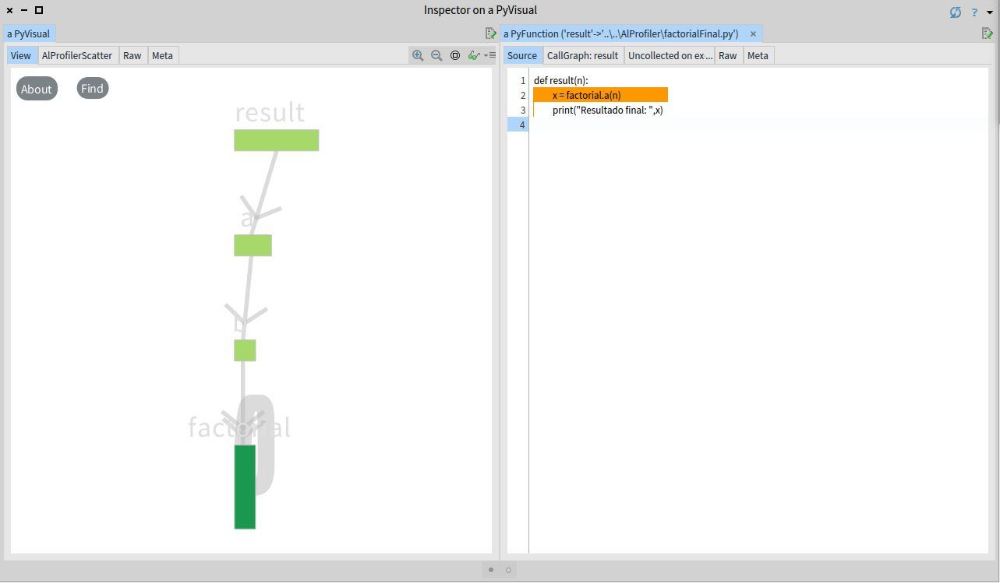
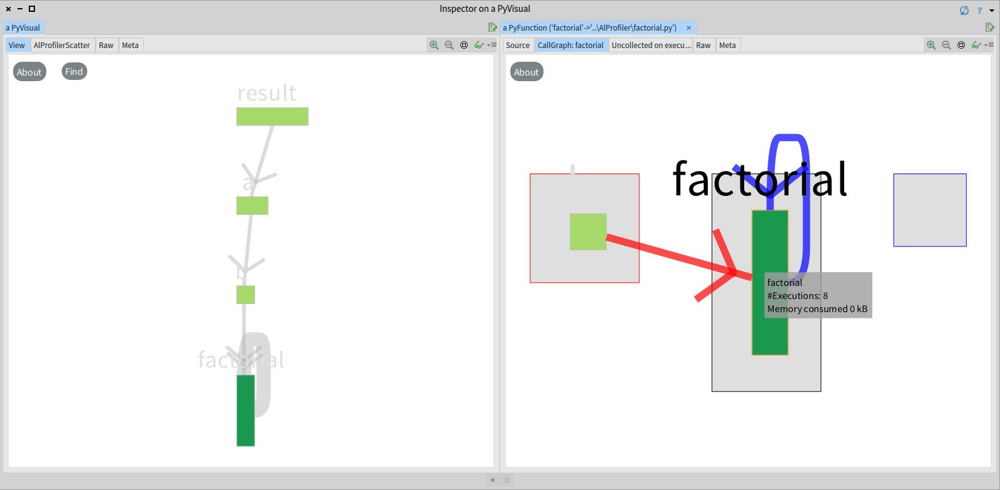
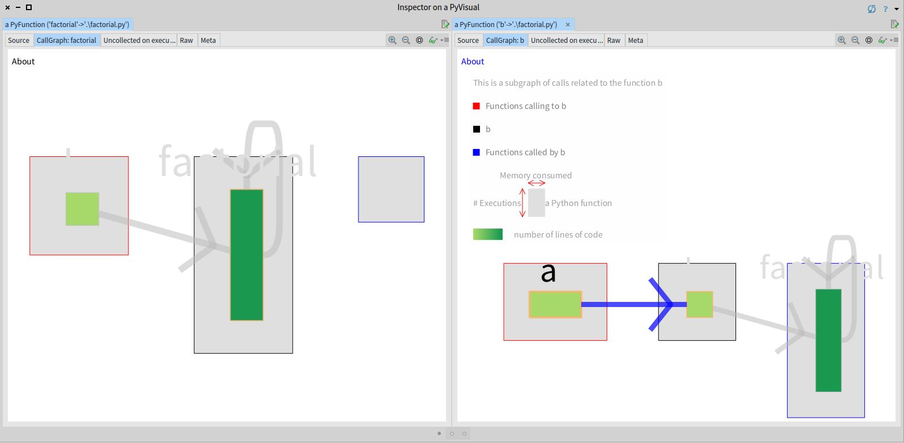
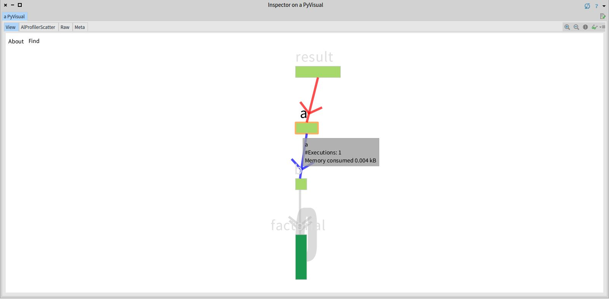
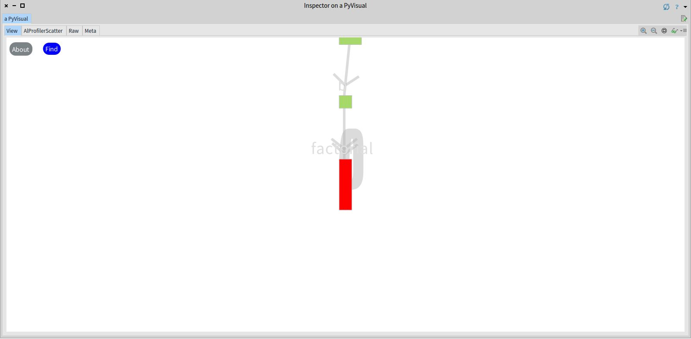

# Vismep 

**Reading time: 3-5 minutes.**

Vismep is a memory profiler that helps programmers understand Python applications' memory consumption through interactive visualizations.

Vismep runs on top of [Pharo](http://pharo.org), the live programming environment.


## System requirements

Running Vismep needs Python 3.X and git.

Also, according to your Operative System, download and unzip the standalone from this [Dropbox](https://www.dropbox.com/sh/0fcpw87wfkn3p2n/AABhROrMdwnhR4-aP1e0nrNNa?dl=0).

## How to use

### Run Vismep

Open a terminal and execute the following script:

```
path/to/runProfilerScript path/to/PrincipalFile.py runFunction argumentsFunction
```

To execute the script, the user needs:

-   **path/to/runProfilerScript** - The path of the runProfiler script from the standalone (a script called runProfiler.bat in Windows or runProfiler.sh in Linux/MAC located on the standalone directory downloaded from [Dropbox](https://www.dropbox.com/sh/0fcpw87wfkn3p2n/AABhROrMdwnhR4-aP1e0nrNNa?dl=0)).
-   **path/to/PrincipalFile.py** - The path of the python file to be analyzed.
-   **runFunction** - The function to be executed from the python file (PrincipalFile.py).
-   **argumentsFunction** - If it's necessary, the arguments for the function (runFunction).


**Examples**:

**Windows**

```
./runProfiler.bat example.py main
```
or
```
./runProfiler.bat example.py main 1 2 3
```

**Linux/MAC**

```
./runProfiler.sh example.py main
```
or
```
./runProfiler.sh example.py main 1 2 3
```

The execution of the script will generate a folder named Vismep_example with four .csv files in the current directory.


### Start Vismep

Go to the directory where you previously downloaded and unzipped the standalone from [Dropbox](https://www.dropbox.com/sh/0fcpw87wfkn3p2n/AABhROrMdwnhR4-aP1e0nrNNa?dl=0). Then double click the executable Pharo.exe (for Windows), pharo (for Linux), or Pharo (for MAC at Pharo.app/Contents/MacOS on the folder downloaded and unzipped). If the double click doesn't work, open a terminal and execute the following script (consider that Pharo.exe-pharo-Pharo.app/Contents/MacOS/Pharo and Visualization.image are in the directory downloaded from the Dropbox):

**Windows**

```
path/to/Pharo.exe path/to/Visualization.image
```

If you are on the standalone directory downloaded from Dropbox, the script will be:

```
./Pharo.exe ./Visualization.image
```

**Linux**

```
path/to/pharo path/to/Visualization.image
```

If you are on the standalone directory downloaded from Dropbox, the script will be:

```
./pharo Visualization.image
```

**MAC**

```
path/to/Pharo.app/Contents/MacOS/Pharo path/to/Visualization.image
```

If you are on the standalone directory downloaded from Dropbox, the script will be:

```
./Pharo.app/Contents/MacOS/Pharo Visualization.image
```

## Visualizations

Executing the previous script will open a Pharo image. To visualize the information extracted from the Python file, click on the *PyMemory* tab from the menu at the top and select *Open directory*. Then select the folder named Vismep_example generated at [Run Vismep](#run-vismep) as shown in the following image:


### Call graph view
Once seleced the folder, the *Call graph view* is displayed as shown in the following image: 




In this example, the program under analysis has a running function named *result* that calls to *a* function. Then *a* function calls to *b* function, and *b* function calls to *factorial* function (a recursive function).

**Nodes**:  Each node represents a function/method invoked during program execution. As the previous figure shows, a unique node represents each function, where:
- The width indicates the average memory consumed by the function/method.
- The height represents the number of times the function/method is executed.
- Their color fades from a lighter to dark green to represent the number of lines of code defining the function (the fewer lines, the lighter green). However, the color is gray if the profiler cannot retrieve the source code (e.g., defined in native C sources). 
- The border shows if the function/method belongs to an external library (e.g., pandas, random). 

**Edges**: Represents the calling relationship between functions/methods using an arrow to indicate the direction of the call. Also, the width of the edge indicates the number of times the call between two functions occurs during execution. For example, in the figure above, *factorial* function calls itself more than other calls in the graph.


**Layout**: The visualization uses as default a vertical layout that places the nodes to represent calling relationships between the functions/methods and the execution order. Consequently, the relation between callers and callees is made from top to bottom, and the execution order is given from left to right.

### Source code view
Clicking on a function/method displays the *Source code view*. This visualization shows the source code of the selected function/method and connects it with dynamic information. This visualization highlights the background code lines based on the memory used. The background fades from light gray (i.e., little memory consumption) to orange (i.e., high memory consumption) depending on how much memory consumption increased after executing that line. A white background indicates that the memory did not increase. 



### Sub call graph view
When selecting the *Callgraph* tab at the top of the *Source code view*, the *Sub call graph view* is shown instead of the source code. This view presents a summarized call graph based on the selected function/method. It shows the callers and callees of a selected function/method, where the callers (inside the box with a red border) and callees (inside the box with a blue border) are located at the left and right of the selected function/method, respectively. For instance, the following figure displays that the  *factorial* function was selected; therefore, its *Sub call graph view* is shown on the right panel. 

 

The following figure illustrates that *b* function is selected in the *Sub call graph view* from *factorial* function. Consequently, the *Sub call graph view* of *b* function is displayed on the right panel. 



### Scatter plot view
This view illustrates each function/method as a colored point based on the number of lines of code, and it is placed on the graph according to the total memory consumed (Y-axis) and the number of executions (X-axis). In some cases, the total memory consumed (sum of memory consumption per execution) is negative. The latter indicates that during some execution or executions of a function/method, the garbage collector is activated, and several blocks of memory are released. 

### Interactions
Vismep provides several interactions to facilitate the exploration of the Python application under analysis.

-   **Canvas movement** The user can pan the view around the different visualizations, zoom in and out by arbitrary distances, and zoom the display to fit the entire visualization.

-   **Mouse hovering** When the user hovers the mouse cursor above an invoked function/method, a popup window appears with information about the respective function/method, such as the name, the number of executions, and the average amount of memory consumed. If the user performs this action over an invoked function/method in the *Call graph view* and the *Sub call graph view*, the edges with callers and callees are highlighted in red and blue, respectively. The following figure shows this interaction.

  

-   **Drag** The user can select a function/method node and drag the node with all its callees nodes to change the position of nodes in the *Call graph view* and *Sub call graph view*.


-   **Search** The user can search for a specific function/method using the "Find" button. The user should select the desired function/method from a window that enlists the functions/methods that fulfill the query. Consequently, the selected function/method is highlighted in red. For example, the *factorial* function was searched and found in the following figure.


  
-   **Drill down** Vismep provides the user an option to obtain detailed data about a particular invoked function/method. Clicking a function/method shows two views: *Source code view* and *Sub call graph view*.
